# Identity

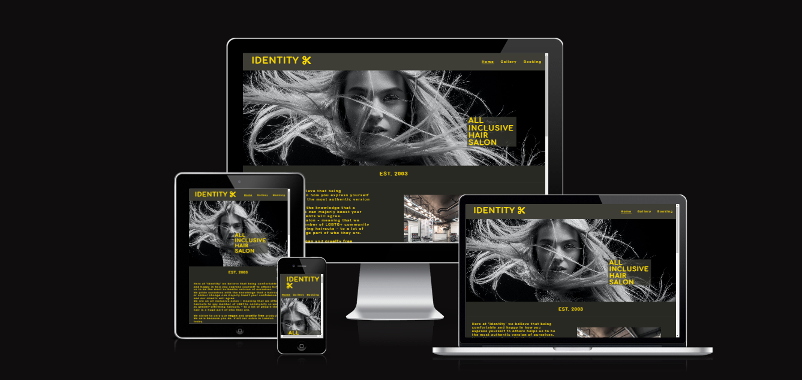 
[Live webpage](https://emmygood.github.io/identity/)

## Introduction

Identity is a site about a London hair salon that caters to an LGBTQ+ audience. The site offers a friendly welcome to those who wish to be their authentic true selves in a safe and friendly environment without intimidation; which to most is paramount. The site showcases the styles it offers as well as the ease of choosing what service they which to receive, and easy to follow booking system. 

---
## Table of content
* [User Experience](#user-experience)

* [UX](#ux)
   * [Color Palette](#color-palette)
   * [Typography](#typography)

* [Features](#features)
  * [Common Features](#common-features)
    * [Navigation Bar](#navigation-bar)
    * [Hero Image](#hero-image)
    * [Footer](#footer)
    * [Salon Ethos](#salon-ethos-feature)
    * [Opening times and Service prices](#opening-times-and-service-prices)
    * [Address and Google maps](#address-and-google-maps)
    * [Gallery](#gallery)
    * [Booking Form](#booking-form)
    * [Confirmation Page](#confirmation-page)
    * [Future Features](#future-features)

* [Tools and Technologies](#tools-and-technologies)

* [Testing](#testing)
   * [HTML Validator](#html-validating)
   * [CSS Validator](#css)

* [Responsiveness](#responsiveness)
  * [Compatability](#compatability)
  * [Lighthouse](#lighthouse)

* [Deployment](#deployment)
  * [Local Deployment](#local-deployment)
  * [Cloning](#cloning)
  * [Forking](#forking)

* [Credits](#credits)
  * [Content](#content)
  * [Media](#media)
  * [Acknowledgements](#acknowledgements)  

---
## User Experience

### Audience 
1. People looking for a safe, friendly environment to get their haircut.
2. People looking for a place that caters to their needs.
3. People looking for a salon that is current with the latest hair techniques.

### Expectations
1. Easily click through the site and gather all relevant information.
2. Clear layout and presentation.
3. Accessible for all.
4. Easy way to book in or call the salon.
5. Clickable links that function properly.
6. Clear and easy to read content to read quickly.

### First time user
1. As a first time user, I want to know what the salon offers.
2. I want to know where the store is located.
3. I want to know the price of the services.
4. I want to know the opening times.

### Returning user
1. As a returning user, I want to be able to book in easily.
2. I want to find them on social media platforms.
3. I want to be able to look at past work.
4. I want to know directions to the salon.

### Site owner
1. As the site owner, I want users to gain an understanding of what the salon offers.
2. I want people to be able to find us on social media.
3. I want the users to know what services we offer.

---

## UX
### Color Palette

Identity is a site created for inclusion. Therefore I have taken inspiration using certain colors from the non-binary flag; yellow and black. Representing gender without reference to the binary and lack of gender. I then chose yellow to be the main color of the text throughout the body, contrasting to the dark grey, as it's associated with happiness and hope.
The yellow contrasts against the dark grey nicely, making it easily readable.
I used [coolors.co](https://coolors.co/292924-3e3e37-ffdd00-ffeb66) to generate my color palette.

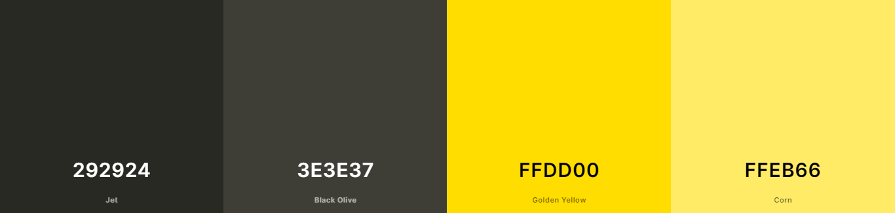

### Typography

[GoogleFonts.com](https://fonts.google.com/?query=com) was imported to select all the fonts. With sans-serif as a fallback for both 'Comfortaa' and 'Rubik'. These two fonts are similar but pair together nicely. I wanted to opt for something simple and easy to read, for accessibility, but also choose something a little bit 'different'.

- [Comfortaa](https://fonts.google.com/specimen/Comfortaa?query=com) was used for the primary headers and titles.

- [Rubik](https://fonts.google.com/specimen/Rubik?query=rubik) was used for all the secondary text.

- [Font Awesome](https://fontawesome.com) was used throughout the site such as the logo, address pin, booking form, phone number, confirmation page, and social media icons in the footer.

## Features

### Common Features

#### Navigation Bar
- The navigation bar is common across all pages. Including 'Home', 'Gallery', and 'Booking'. These links are in convention with the logo, which situates itself on the left and the navigation links to the right. These then become responsive depending on the users screen size.
- The three links are easily accessible on all pages, to browse the site with ease.
- The Logo - which includes a font awesome icon - is a clickable link, providing a shortcut which will take the user back to the homepage if needed. 
- The icon next to the logo helps the ser to gain a quick understanding of what the site is about.
- To let the user know visually what page they are currently on, a line appears underneath the text, as well as when they hover over it. The color of this is in keeping with the color of the text.

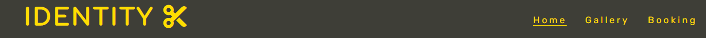

### Hero Image
- The hero image is only visible on the homepage. The image is in black and white so it doesn't distract from the text.
- Because the image is not in color, the hair itself is what creates a dramatic feature; which is the goal.
- It contains a cover text overlayed in a transparent box which gives a brief summary to the user what the site is about. This box is on the right when shown on desktops but becomes responsive when shown on smaller screens.

### Footer 
- The footer is a common feature which is visible on all pages. It contains three social media clickable icons, which provide visible cues to prompt the user to click on the social media platforms related to Identity.
- These links are kept out of the way of the main features on the site, but remain in the same spot on all three pages, which gives the user easier access to find them.
- The lower part of the footer contains the copywrite information, which when clicked takes you through to my github profile.

### Salon Ethos Feature
- At the top of this section is when the salon was established.
- In the salon ethos section this describes the main ethos of the salon in more depth. Providing the user with information as to whether they would be interested in visiting. This is situated on the left.
- Next to the text, is a photo of inside the salon, providing more information to the user.
- This section's background color is #292924; the darker of the grey. Which helps break up the sections.

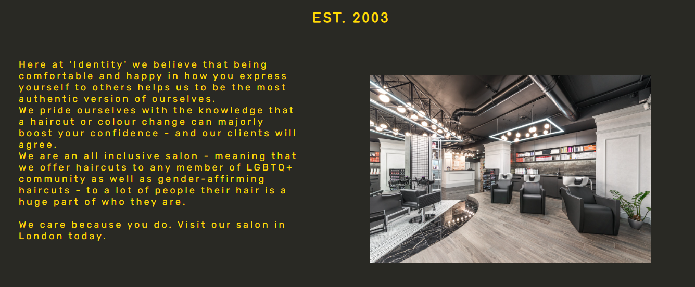

### Opening times and service prices
- This section is split into two halves; on the left you have the opening times, and on the right you have the service prices.
- By using a background image behind opening times, this helps to create a divide between the two sections. 
- I have also added a transparent layer over the image so the text is more readable.
- These are shown on the homepage in order for the user to have immediate access to what the salon offers.

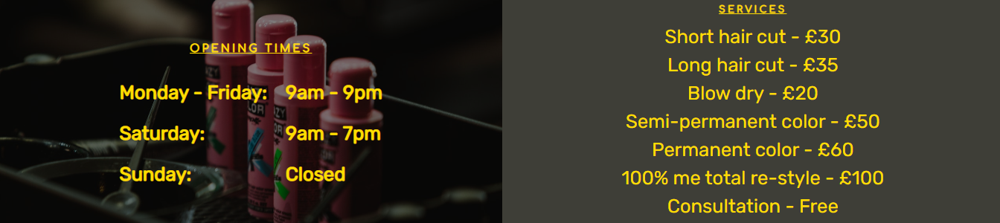

### Address and Google Map
- This contains the salon address, with the Google Maps location underneath.
- This is on the homepage as it is one of the first things the user would be looking for.

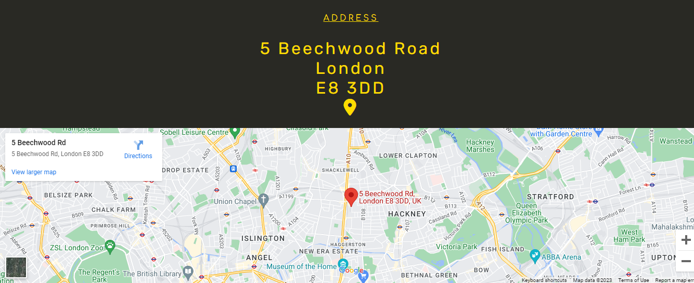

### Gallery Feature
- The gallery page offers users to view past work through these professional photos as well as in salon.
- This is in the format of a masonary gallery, so the user can see more than one photo without having to scroll too far down the page.
- This allows the user to see what is in offer at the salon.
- These images will display one at a time in a column when the user is using a phone.

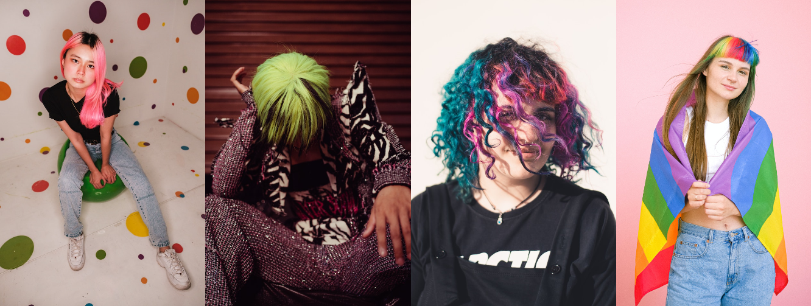
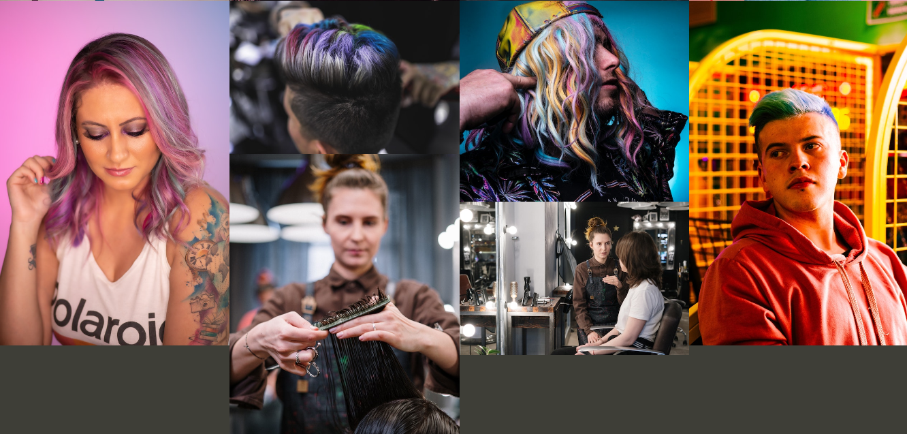

### Booking form
- The booking page provides a phone number as alternative contact.
- The booking form asks users to follow easy to understand steps.
- Each input box text goes from black to white when the user hovers over each input field.
- The user is asked for their: name, phone number, email address, date and what service.
- There are two radio buttons asking if they've been their before.
- When the user has completed the form they will taken to a confirmation page.

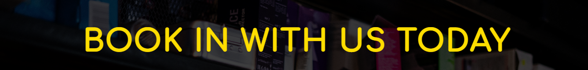
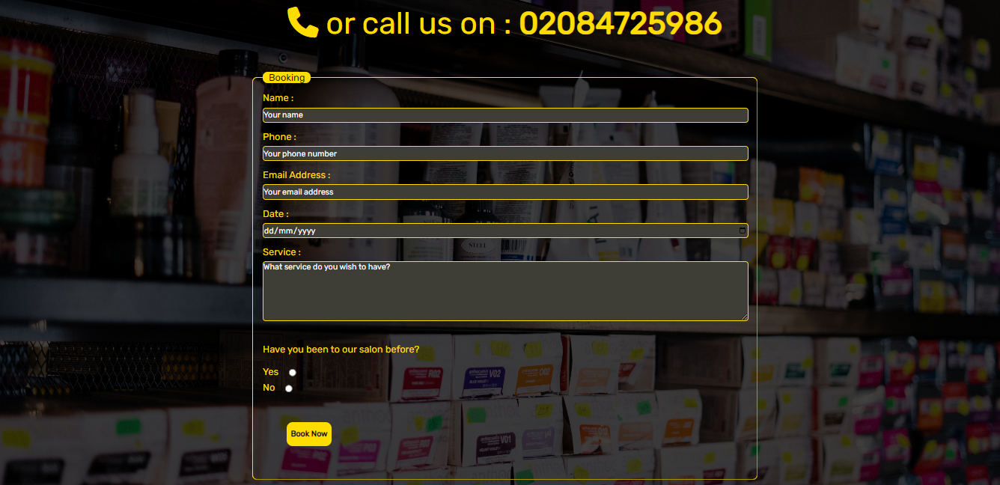

### Confirmation page
- Once the user has filled in the booking form they will be redirected to a confirmation page, so they know their booking was a success.
- This has the same stylings of the booking page, to keep things streamlined.
- A font awesome icon is used here.
- After 10 seconds, they will then be redirected back to the homepage.

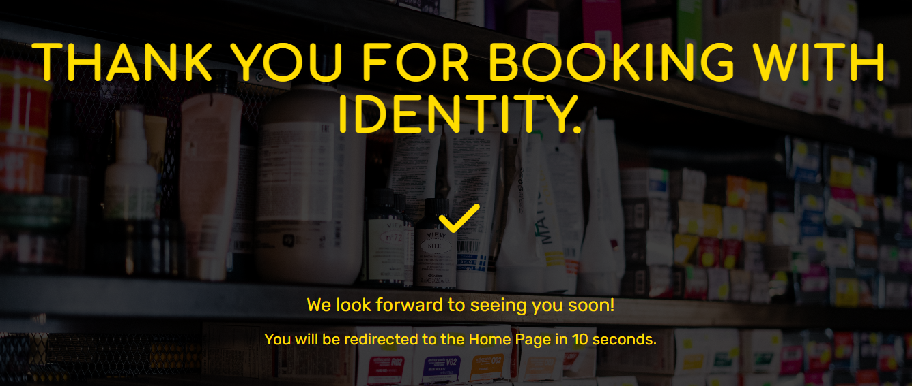

### Future Features
- New feature #1
  - More photos added to the gallery.

- New feature #2
  - A page where users can virtually shop for hair care products.

- New feature #3
  - When booking in, for there to be a option to sign up for a monthly newsletter with offers on services and prodcuts.

## Tools and Technologies used

- [HTML](https://en.wikipedia.org/wiki/HTML) used for the main site content.
- [CSS](https://en.wikipedia.org/wiki/CSS) used for the site design as well as layout.
- [CSS-Flexbox](https://www.w3schools.com/css/css3_flexbox.asp) used to enhance the responsive layout.
- [CSS-Color-Converter](https://www.w3schools.com/colors/colors_converter.asp) used for the site design colors.
- [Git](https://git-scm.com) used for version control. (`git add`, `git commit`, `git push`)
- [GitHub](https://github.com) used for secure online code storage.
- [GitHub Pages](https://pages.github.com) used for hosting the deployed front-end site.
- [Markdown Builder by Tim Nelson](https://traveltimn.github.io/readme-builder) used to help generate the Markdown files.

# Testing 
I have tested the website on a variety of different browsers (Chrome, Firefox, Safari) and screen sizes (laptop, desktop, smartphones). As well as testing the site with development tools, whilst building, to ensure the responsiveness across different screen sizes.

## HTML Validation

- I have used the recommended [HTML W3C Validator](https://validator.w3.org) to validate all of my HTML files.

* Home  - Pass: No Errors [W3C](https://validator.w3.org/nu/?doc=https%3A%2F%2Femmygood.github.io%2Fidentity%2Findex.html) - link here

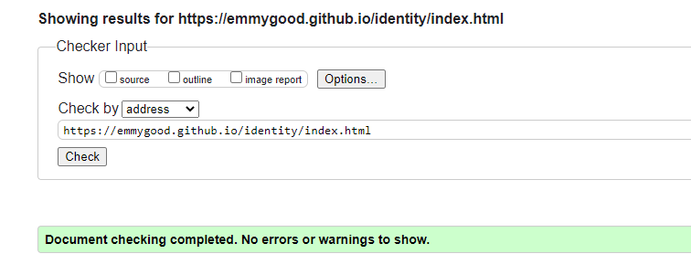

* Gallery - Lack of headings h2-h6 [W3C](https://validator.w3.org/nu/?doc=https%3A%2F%2Femmygood.github.io%2Fidentity%2Fgallery.html) - link here

I am aware of this warning, however this gallery section of this page does not need any headings as there are only images. This does not effect the final look of the site in the browsers.

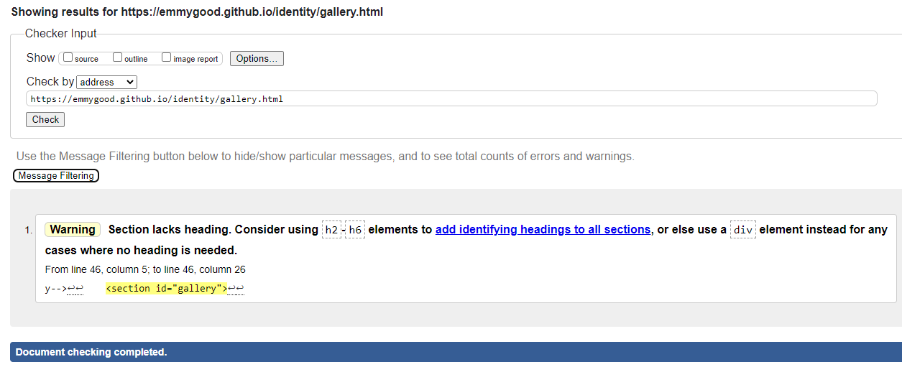
---
* Booking - Pass: No Errors  [W3C](https://jigsaw.w3.org/css-validator/validator?uri=https%3A%2F%2Femmygood.github.io%2Fidentity%2F&profile=css3svg&usermedium=all&warning=1&vextwarning=&lang=en) - link here

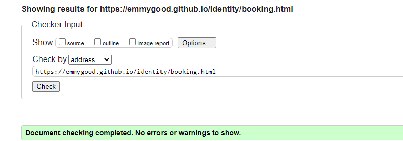

* Confirmation - Pass: No Errors [W3C](https://validator.w3.org/nu/?doc=https%3A%2F%2Femmygood.github.io%2Fidentity%2Fconfirmation) - link here

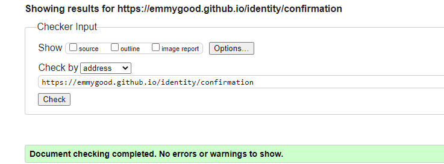

## CSS
---

- I have used the recommended [CSS Jigsaw Validator](https://jigsaw.w3.org/css-validator) to validate all of my CSS files.

Pass: No Errors [W3C](https://jigsaw.w3.org/css-validator/validator?uri=https%3A%2F%2Femmygood.github.io%2Fidentity%2F&profile=css3svg&usermedium=all&warning=1&vextwarning=&lang=en) - link here

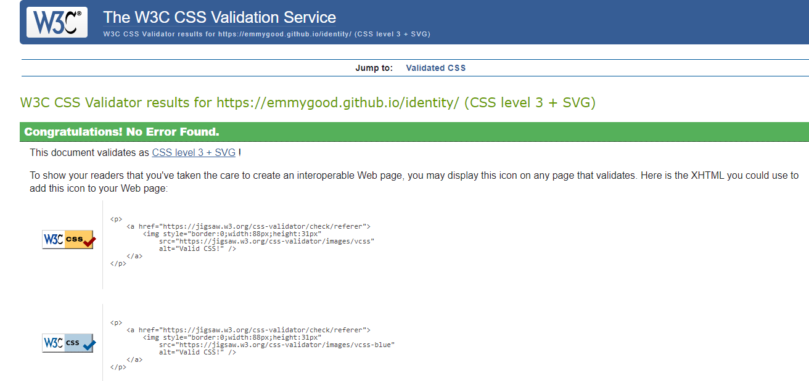
---

---
## Responsiveness

- I have used the Wave Web Accessibility Evaluation Tool to make sure the site is accessible for all. 
All pages passed with no errors. Here are the results below. [Link to all pages](https://wave.webaim.org/report#/https://emmygood.github.io/identity/)

  - Home page - [Wave-link](https://wave.webaim.org/report#/https://emmygood.github.io/identity/index.html)

  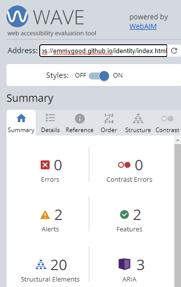

  

  - Gallery - [Wave-link](https://wave.webaim.org/report#/https://emmygood.github.io/identity/gallery.html)

  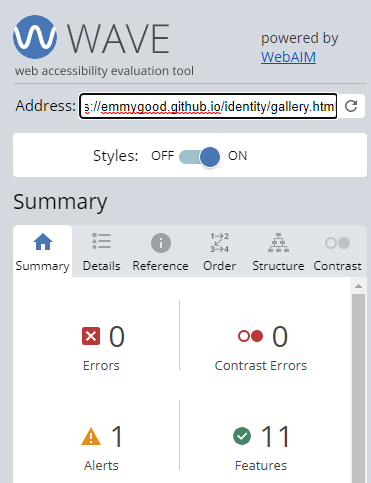

  - Booking - [Wave-link](https://wave.webaim.org/report#/https://emmygood.github.io/identity/booking.html) 

  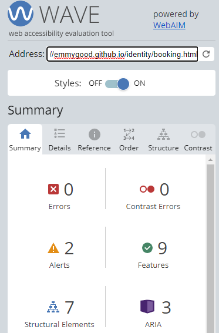

  - Confirmation - [Wave-link](https://wave.webaim.org/report#/https://emmygood.github.io/identity/confirmation) - This alerts me to one error, however the error is that the page refreshes back to the homepage. I have left this as it is because that is the effect that I wanted.

  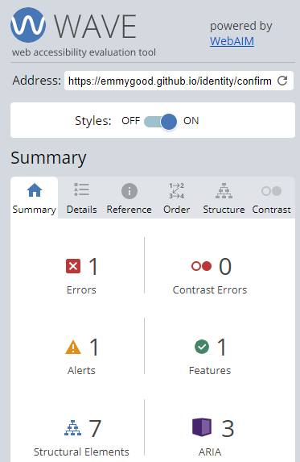

---

## Compatability
- I tested the site on my smartphone (Samsung) and was very pleased all the features responded well to the smaller screen size. As a user I was able to easily click through all the pages and fill out the booking form with no problems. It was also tested on different models of I-Phone and tablets. Here are the screenshots below. 

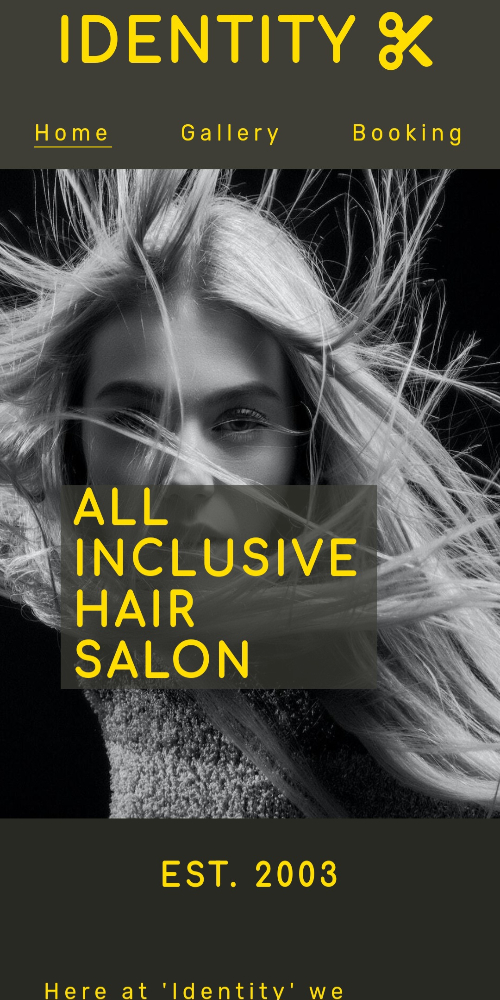

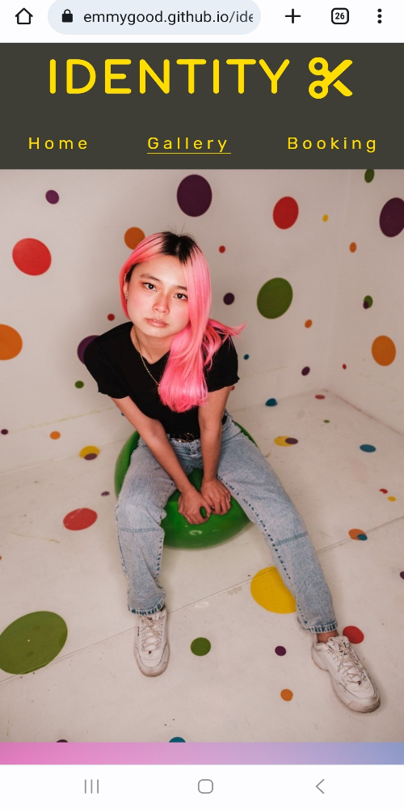
.jpg)

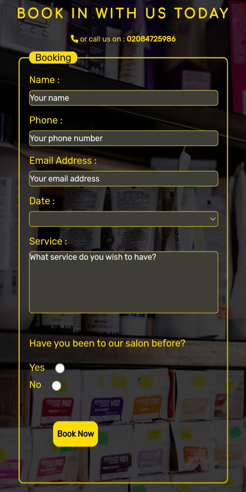

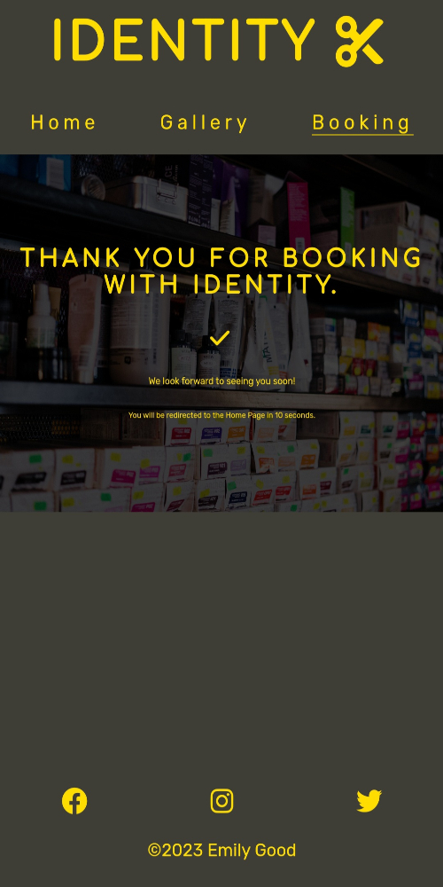

---

## Lighthouse
- I generated a lighthouse reports for each page, for both mobile and desktop devices, through Chrome dev tools. Here are the results below for HOME - GALLERY - BOOKING - CONFIRMATION. For the booking and confirmation pages the scores were a little lower because of the image file sizes, so I used [Convertio](https://convertio.co/jpg-jpeg/) to make the image files smaller and this helped improve the overall performance score.

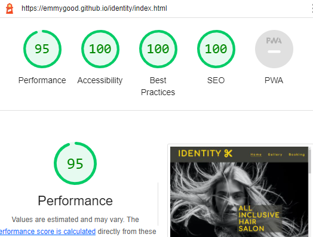

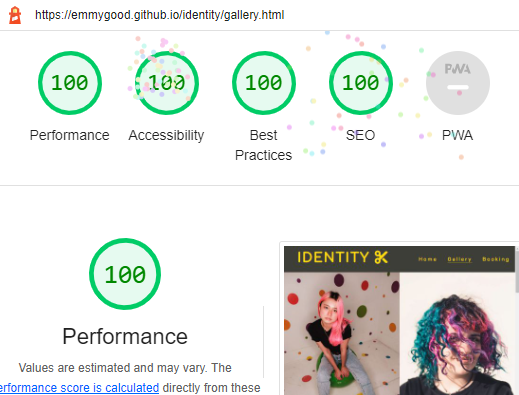

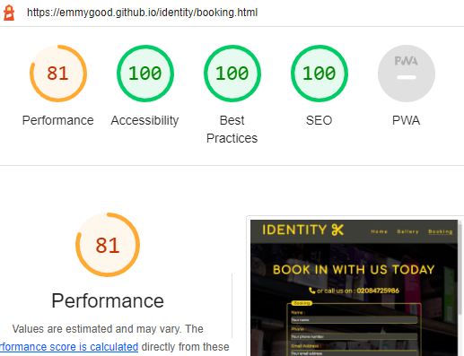

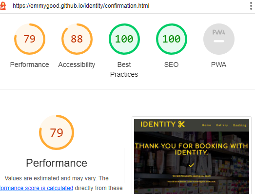

---

## Deployment
The site was deployed to GitHub Pages. The steps to deploy are as follows:
- In the [GitHub repository](https://github.com/emmygood/identity), navigate to the Settings tab
- Select the pages link, on the left hand side.
- From the source section drop-down menu, select the **Main** Branch, then click "Save".
- The page will be automatically refreshed with a detailed ribbon display to indicate the successful deployment.

The live link can be found [here](https://emmygood.github.io/identity)

### Local Deployment
This project can be cloned or forked in order to make a local copy on your own system.

#### Cloning
You can clone the repository by following these steps:

1. Go to the [GitHub repository](https://github.com/emmygood/identity) 
2. Locate the Code button above the list of files and click it 
3. Select if you prefer to clone using HTTPS, SSH, or GitHub CLI and click the copy button to copy the URL to your clipboard
4. Open Git Bash or Terminal
5. Change the current working directory to the one where you want the cloned directory
6. In your IDE Terminal, type the following command to clone my repository:
	- `git clone https://github.com/emmygood/identity.git`
7. Press Enter to create your local clone.

- Alternatively, if using Gitpod, you can click below to create your own workspace using this repository.

  

- Please note that in order to directly open the project in Gitpod, you need to have the browser extension installed.

#### Forking
You can fork this repository by using the following steps:

1. Log in to GitHub and locate the [GitHub Repository](https://github.com/emmygood/identity)
2. At the top of the Repository (not top of page) just above the "Settings" Button on the menu, locate the "Fork" Button.
3. Once clicked, you should now have a copy of the original repository in your own GitHub account!

---

## Credits

### Content
- The text on all pages was created by myself.
- [Markdown Builder by Tim Nelson](https://traveltimn.github.io/markdown-builder) README and TESTING tool to help generate the Markdown file.
- [W3Schools](https://www.w3schools.com/howto/howto_js_topnav_responsive.asp) entire site, responsive HTML/CSS/JS navbar.
- Reference material was used from [W3Schools](https://www.w3schools.com/) for flexbox, color converting, and general reference aid.
- [Flexbox Froggy](https://flexboxfroggy.com/) entire site, modern responsive layouts.
- [YouTube](https://www.youtube.com/watch?v=fYq5PXgSsbE&ab_channel=WebDevSimplified) entire site, flexbox tutorial. 

### Media
- The icons I used were taken from [Font Awesome](https://fontawesome.com).
- the images used throughtout the site are taken from [Pexels](https://www.pexels.com/).
- [Convertio](https://convertio.co/jpg-jpeg/) entire site images.

### Acknowledgements
- I would like to thank my Code Institute mentor [Tim Nelson](https://github.com/TravelTimN)  for their support throughout the development of this project.
- I would like to thank [Code Institute](https://codeinstitute.net) for their learning resources.
- I would like to thank the [Code Institute Slack community](https://code-institute-room.slack.com) for the moral support.
- I would like to thank myself for the hard work.
