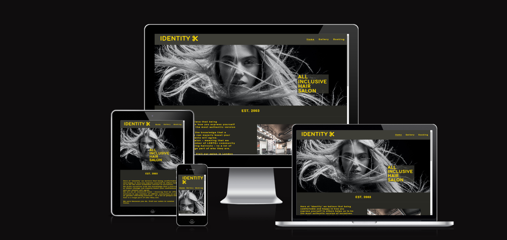

# Identity

 

## Introduction
Identity is a site about a London hair salon that caters to an LGBTQ+ audience. The site offers a friendly welcome to those who wish to be their authentic true selves in a safe and friendly environment without intimidation; which to most is paramount. The site showcases the styles it offers as well as the ease of choosing what service they which to receive, and easy to follow booking system. 